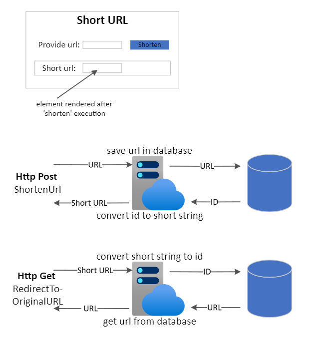
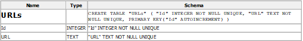

# UrlShortener

This is a simple URL Shortener solution created with the use of Dotnet MVC and Sqlite database. Db files are included in the project and installation of Sqlite is not required. In order to view the database I recommend the following DB Browser : https://sqlitebrowser.org/. 

General Idea:

*I wanted this application to be ready to run straight after being cloned from repo without pre-initializing and populating with data hence I decided to upload binary sqlite db files. I am aware that git repository is not designed for it and the downside of this solution is not being able to track database changes in version control. The solution for it going forward is to dump Sqlite db structure and data into the script and only keep that script in version control.*